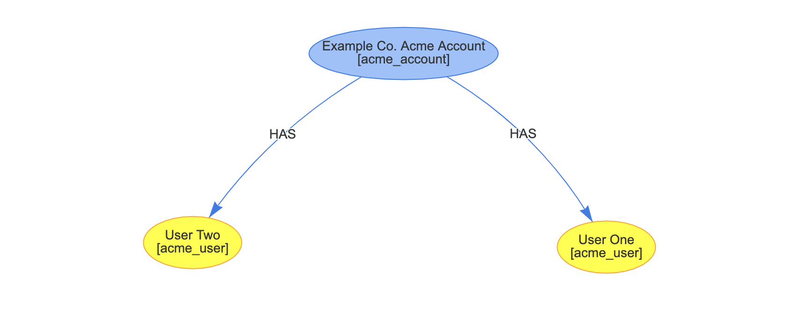

# JupiterOne Integration

Learn about the data ingested, benefits of this integration, and how to use it
with JupiterOne in the [integration documentation](docs/jupiterone.md).

## Development

### Prerequisites

1. Install [Node.js](https://nodejs.org/) using the
   [installer](https://nodejs.org/en/download/) or a version manager such as
   [nvm](https://github.com/nvm-sh/nvm) or [fnm](https://github.com/Schniz/fnm).
2. Install [`yarn`](https://yarnpkg.com/getting-started/install) or
   [`npm`](https://github.com/npm/cli#installation) to install dependencies.
3. Install dependencies with `yarn install`.
4. Register an account in the system this integration targets for ingestion and
   obtain API credentials.
5. `cp .env.example .env` and add necessary values for runtime configuration.

   When an integration executes, it needs API credentials and any other
   configuration parameters necessary for fetching data from the provider. The
   names of these parameters are defined in `src/instanceConfigFields.ts`. When
   executed in a development environment, values for these parameters are read
   from Node's `process.env`, loaded from `.env`. That file has been added to
   `.gitignore` to avoid commiting credentials.

### Running the integration

1. `yarn start` to collect entities and relationships and store them locally at
   `./.j1-integration/`:
   
2. `yarn graph` to generate a visualization of the entities and relationships in
   `./.j1-integration/`:
   
3. `yarn j1-integration -h` for additional commands

### Making Contributions

Start by taking a look at the source code. The integration is basically a set of
functions called steps, each of which ingests a collection of resources and
relationships. The goal is to limit each step to as few resource types as
possible so that should the ingestion of one type of data fail, it does not
necessarily prevent the ingestion of other, unrelated data. That should be
enough information to allow you to get started coding!

See the
[SDK development documentation](https://github.com/JupiterOne/sdk/blob/master/docs/integrations/development.md)
for a deep dive into the mechanics of how integrations work.

See [docs/development.md](docs/development.md) for any additional details about
developing this integration.

### Changelog

The history of this integration's development can be viewed at
[CHANGELOG.md](CHANGELOG.md).
